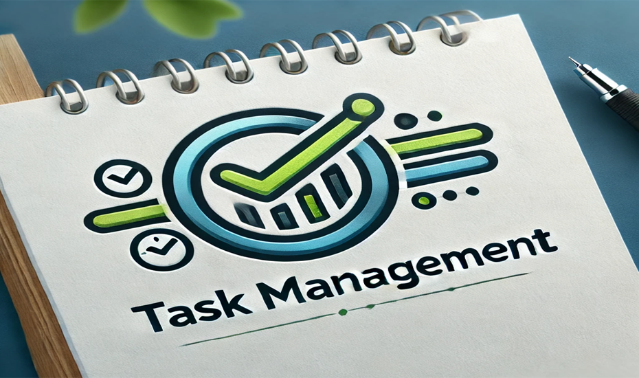
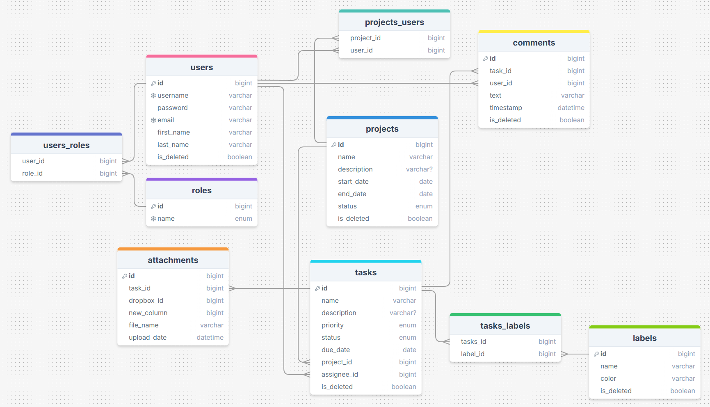

# Task Management App

Manage tasks and projects effectively through a web-based application. This system enables task creation, assignment, progress tracking, and completion.

## Technologies Used in the project
- Backend: Spring Framework (Spring Boot, Spring Security, Spring Data JPA), JWT, MySQL, Mapstruct, Jackson
- Build Tool: Maven
- Database Migration: Liquibase
- Containerization: Docker
- Testing: JUnit, Mockito, Test Containers
- API Documentation: Swagger

## Tools used for development:
- IntelliJ IDEA (Ultimate Edition)
- Postman
- GitHub
- Dropbox

## Layered Architecture
- **Controller Layer**: Handles incoming HTTP requests and communicates with clients. Controllers contain methods that process these requests and call the necessary services to execute business operations.
- **Service Layer**: Encapsulates the business logic of the application. This layer manages data processing and interaction with repositories and mappers to fulfill business requirements.
- **Repository Layer**: Manages direct interactions with the database. Repositories are responsible for querying, saving, updating, and deleting data as dictated by the application's needs.
- **Security Layer**: Oversees authentication and authorization processes. This layer ensures secure access to resources by implementing role-based access control mechanisms.
- **DTO** (Data Transfer Object) Layer: Consists of objects designed for transferring data between different layers of the application, streamlining data communication by including only necessary information.
- **Mapper Layer**: Facilitates the conversion between different object models, specifically between entities and Data Transfer Objects (DTOs), ensuring data consistency across layers.
- **Test**: Encompasses unit and integration tests that validate the functionality and correctness of various application components, including controllers, services, and repositories.

## SQL Database Diagram
Below is a representation of the database used in the project:



## Controllers

1. **Auth Controller**:
    - POST: /api/auth/register - User registration
    - POST: /api/auth/login - User authentication

2. **Users Controller**: Managing authentication and user registration
    - PUT: /users/{id}/role - update user role (only for admin role)
    - GET: /users/me - get my profile info
    - PUT/PATCH: /users/me - update profile info

3. **Project Controller**:
    - POST: /api/projects - Create a new project  (only for admin role)
    - GET: /api/projects - Retrieve user's projects
    - GET: /api/projects/{id} - Retrieve project details
    - PUT: /api/projects/{id} - Update project (only for admin role)
    - DELETE: /api/projects/{id} - Delete project (only for admin role)

4. **Task Controller**:
    - POST: /api/tasks - Create a new task (only for admin role)
    - GET: /api/tasks - Retrieve tasks for a project
    - GET: /api/tasks/{id} - Retrieve task details
    - PUT: /api/tasks/{id} - Update task (only for admin role)
    - DELETE: /api/tasks/{id} - Delete task (only for admin role)

5. **Comment Controller**:
    - POST: /api/comments - Add a comment to a task
    - GET: /api/comments/{taskId} - Retrieve comments for a task

6. **Attachment Controller**:
    - POST: /api/attachments - Upload an attachment to a task (File gets uploaded to Dropbox and we store the Dropbox File ID in our database)
    - GET: /api/attachments/{taskId} - Retrieve attachments for a task (Get the Dropbox File ID from the database and retrieve the actual file from Dropbox)

7. **Label Controller**:
    - POST: /api/labels - Create a new label (only for admin role)
    - GET: /api/labels - Retrieve labels
    - PUT: /api/labels/{id} - Update label (only for admin role)
    - DELETE: /api/labels/{id} - Delete label (only for admin role)

## How to run Task Management App
1. Download and install [Docker](https://www.docker.com/products/docker-desktop/), [Maven](https://maven.apache.org/download.cgi), [JDK Development Kit](https://www.oracle.com/pl/java/technologies/downloads/).
2. Clone the project [git repository](https://github.com/QbaSekowski/task-management-app.git).
3. In the .env.template file you should provide necessary DB and Docker variables, here is an example:
```mysql
MYSQLDB_USER=root
MYSQLDB_ROOT_PASSWORD=root
MYSQLDB_DATABASE=task_management_db
MYSQLDB_LOCAL_PORT=3307
MYSQLDB_DOCKER_PORT=3306

JWT_EXPIRATION=3000000
JWT_SECRET=your_secret_for_jwt_token

DROPBOX_ACCESS_TOKEN=your_access_token_to_dropbox

SPRING_LOCAL_PORT=8088
SPRING_DOCKER_PORT=8080
DEBUG_PORT=5005
```
then rename file .env.template to .env
4. Run the command `mvn clean package`.
5. Use `docker-compose build` to build Docker container.
6. Use `docker-compose up` to run Docker container.
7. Access the locally running application at http://localhost:8088.
   Feel free to test my application using Postman/Swagger.  
   **Postman**: Keep in mind that you have to pass Authorization (Bearer Token) that you receive when logging in.  
   Do you want to test admin features? Here are credentials of sample admin:
   ```json
   {
   "email": "admin@gmail.com",
   "password": "12345678"
   }
   ```
   or perhaps standard user features:
   ```json
   {
   "email": "jurek@wp.pl",
   "password": "qwertyui"
   }
   ```
## Challenges
The biggest challenge for me personally was understanding how Dropbox works and how to use it in an application. This required studying the documentation provided by its creators, and based on that, figuring out how to write functionality specifically for my application.